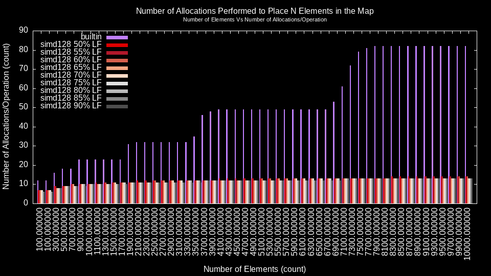
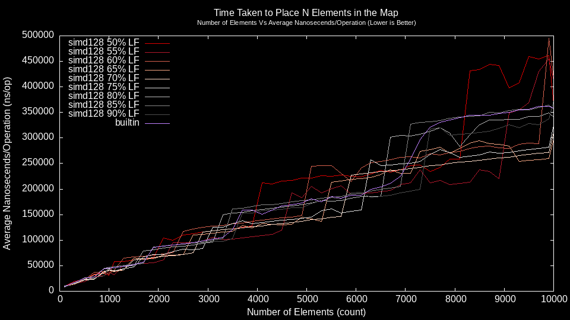

<!-- gomarkdoc:embed:start -->

<!-- Code generated by gomarkdoc. DO NOT EDIT -->

# sbmap

```go
import "github.com/barbell-math/smoothbrain-hashmap"
```

A very simple library that implements a generic, linear probing map.

<details><summary>Example (Custom Eq And Hash Funcs)</summary>
<p>


```go
seed := maphash.MakeSeed()

h := NewCustom[string, string](
	4,
	func(l, r string) bool { return strings.ToLower(l) == strings.ToLower(r) },
	func(v string) uint64 { return maphash.String(seed, strings.ToLower(v)) },
)
h.Put("one", "one")
h.Put("two", "two")
h.Put("three", "three")
h.Put("ThReE", "four")

if val, ok := h.Get("three"); ok {
	fmt.Println(val)
}

h.Remove("tWO")
fmt.Println(h.Len())

fmt.Println("Keys:")
keys := slices.Collect(h.Keys())
slices.Sort(keys)
fmt.Println(keys)

// Output:
//four
//2
//Keys:
//[one three]
```

#### Output

```
four
2
Keys:
[one three]
```

</p>
</details>

<details><summary>Example (Simple)</summary>
<p>


```go
h := New[int, string]()
h.Put(1, "one")
h.Put(2, "two")
h.Put(3, "three")

if val, ok := h.Get(1); ok {
	fmt.Println(val)
}
if _, ok := h.Get(4); !ok {
	fmt.Println("4 was not in the map!")
}

h.Remove(1)
fmt.Println(h.Len())

fmt.Println("Keys:")
keys := slices.Collect(h.Keys())
slices.Sort(keys)
fmt.Println(keys)

// Output:
//one
//4 was not in the map!
//2
//Keys:
//[2 3]
```

#### Output

```
one
4 was not in the map!
2
Keys:
[2 3]
```

</p>
</details>

## Index

- [func ComparableEqual\[T comparable\]\(l T, r T\) bool](<#ComparableEqual>)
- [func ComparableHash\[T comparable\]\(\) func\(v T\) uint64](<#ComparableHash>)
- [type Map](<#Map>)
  - [func New\[K comparable, V comparable\]\(\) Map\[K, V\]](<#New>)
  - [func NewCap\[K comparable, V comparable\]\(\_cap int\) Map\[K, V\]](<#NewCap>)
  - [func NewCustom\[K any, V any\]\(\_cap int, eq func\(l K, r K\) bool, hash func\(v K\) uint64\) Map\[K, V\]](<#NewCustom>)
  - [func \(m \*Map\[K, V\]\) Clear\(\)](<#Map[K, V].Clear>)
  - [func \(m \*Map\[K, V\]\) Copy\(\) \*Map\[K, V\]](<#Map[K, V].Copy>)
  - [func \(m \*Map\[K, V\]\) Get\(k K\) \(V, bool\)](<#Map[K, V].Get>)
  - [func \(m \*Map\[K, V\]\) Keys\(\) iter.Seq\[K\]](<#Map[K, V].Keys>)
  - [func \(m \*Map\[K, V\]\) Len\(\) int](<#Map[K, V].Len>)
  - [func \(m \*Map\[K, V\]\) PntrVals\(\) iter.Seq\[\*V\]](<#Map[K, V].PntrVals>)
  - [func \(m \*Map\[K, V\]\) Put\(k K, v V\)](<#Map[K, V].Put>)
  - [func \(m \*Map\[K, V\]\) Remove\(k K\)](<#Map[K, V].Remove>)
  - [func \(m \*Map\[K, V\]\) Vals\(\) iter.Seq\[V\]](<#Map[K, V].Vals>)
  - [func \(m \*Map\[K, V\]\) Zero\(\)](<#Map[K, V].Zero>)


<a name="ComparableEqual"></a>
## func [ComparableEqual](<https://github.com/barbell-math/smoothbrain-hashmap/blob/main/map.go#L52>)

```go
func ComparableEqual[T comparable](l T, r T) bool
```

An equality function that can be passed to [NewCustom](<#NewCustom>) when using a comparable type. If the key type is comparable then you can simply use [New](<#New>) instead of [NewCustom](<#NewCustom>) and this function will be Used by default.

<a name="ComparableHash"></a>
## func [ComparableHash](<https://github.com/barbell-math/smoothbrain-hashmap/blob/main/map.go#L59>)

```go
func ComparableHash[T comparable]() func(v T) uint64
```

A hash function that can be passed to [NewCustom](<#NewCustom>) when using a comparable type. If the key type is comparable then you can simply use [New](<#New>) instead of [NewCustom](<#NewCustom>) and this function will be Used by default.

<a name="Map"></a>
## type [Map](<https://github.com/barbell-math/smoothbrain-hashmap/blob/main/map.go#L25-L31>)


```go
type Map[K any, V any] struct {
    // contains filtered or unexported fields
}
```

<a name="New"></a>
### func [New](<https://github.com/barbell-math/smoothbrain-hashmap/blob/main/map.go#L115>)

```go
func New[K comparable, V comparable]() Map[K, V]
```

Creates a Map where K is the key type and V is the value type. [ComparableEqual](<#ComparableEqual>) and [ComparableHash](<#ComparableHash>) functions will be Used by the returned Map. For creating a Map with non\-comparable types or custom hash and equality functions refer to [NewCustom](<#NewCustom>).

<a name="NewCap"></a>
### func [NewCap](<https://github.com/barbell-math/smoothbrain-hashmap/blob/main/map.go#L128>)

```go
func NewCap[K comparable, V comparable](_cap int) Map[K, V]
```

Creates a Map where K is the key type and V is the value type with a capacity of \`\_cap\`. [ComparableEqual](<#ComparableEqual>) and [ComparableHash](<#ComparableHash>) functions will be Used by the returned Map. For creating a Map with non\-comparable types or custom hash and equality functions refer to [NewCustom](<#NewCustom>).

<a name="NewCustom"></a>
### func [NewCustom](<https://github.com/barbell-math/smoothbrain-hashmap/blob/main/map.go#L141-L145>)

```go
func NewCustom[K any, V any](_cap int, eq func(l K, r K) bool, hash func(v K) uint64) Map[K, V]
```

Creates a Map where K is the key type and V is the value type with a capacity of \`\_cap\`. The supplied \`eq\` and \`hash\` functions will be Used by the Map. If two values are equal the \`hash\` function hash function should return the same hash for both values.

<a name="Map[K, V].Clear"></a>
### func \(\*Map\[K, V\]\) [Clear](<https://github.com/barbell-math/smoothbrain-hashmap/blob/main/map.go#L351>)

```go
func (m *Map[K, V]) Clear()
```

Removes all values from the underlying hash but keeps the maps underlying capacity.

<a name="Map[K, V].Copy"></a>
### func \(\*Map\[K, V\]\) [Copy](<https://github.com/barbell-math/smoothbrain-hashmap/blob/main/map.go#L371>)

```go
func (m *Map[K, V]) Copy() *Map[K, V]
```

Creates a copy of the supplied hash map. All values will be copied using memcpy, meaning a shallow copy will be made of the values.

<a name="Map[K, V].Get"></a>
### func \(\*Map\[K, V\]\) [Get](<https://github.com/barbell-math/smoothbrain-hashmap/blob/main/map.go#L183>)

```go
func (m *Map[K, V]) Get(k K) (V, bool)
```

Gets the value that is related to the supplied key. If the key is found the boolean return value will be true and the value will be returned. If the key is not found the boolean return value will be false and a zero\-initialized value of type V will be returned.

<a name="Map[K, V].Keys"></a>
### func \(\*Map\[K, V\]\) [Keys](<https://github.com/barbell-math/smoothbrain-hashmap/blob/main/map.go#L391>)

```go
func (m *Map[K, V]) Keys() iter.Seq[K]
```

Iterates over all of the keys in the map. Uses the stdlib \`iter\` package so this function can be Used in a standard \`for\` loop.

<a name="Map[K, V].Len"></a>
### func \(\*Map\[K, V\]\) [Len](<https://github.com/barbell-math/smoothbrain-hashmap/blob/main/map.go#L156>)

```go
func (m *Map[K, V]) Len() int
```

Returns the number of elements in the hash map. This is different than the maps capacity.

<a name="Map[K, V].PntrVals"></a>
### func \(\*Map\[K, V\]\) [PntrVals](<https://github.com/barbell-math/smoothbrain-hashmap/blob/main/map.go#L422>)

```go
func (m *Map[K, V]) PntrVals() iter.Seq[*V]
```

Iterates over all of the values in the map. Uses the stdlib \`iter\` package so this function can be Used in a standard \`for\` loop. The value may be mutated and the results will be seen by the hash map.

<a name="Map[K, V].Put"></a>
### func \(\*Map\[K, V\]\) [Put](<https://github.com/barbell-math/smoothbrain-hashmap/blob/main/map.go#L224>)

```go
func (m *Map[K, V]) Put(k K, v V)
```

Places the supplied key, value pair in the hash map. If the key was already present in the map the old value will be overwritten. The map will rehash as necessary.

<a name="Map[K, V].Remove"></a>
### func \(\*Map\[K, V\]\) [Remove](<https://github.com/barbell-math/smoothbrain-hashmap/blob/main/map.go#L299>)

```go
func (m *Map[K, V]) Remove(k K)
```

Removes the supplied key and associated value from the hash map if it is present. If the key is not present in the map then no action will be taken.

<a name="Map[K, V].Vals"></a>
### func \(\*Map\[K, V\]\) [Vals](<https://github.com/barbell-math/smoothbrain-hashmap/blob/main/map.go#L406>)

```go
func (m *Map[K, V]) Vals() iter.Seq[V]
```

Iterates over all of the values in the map. Uses the stdlib \`iter\` package so this function can be Used in a standard \`for\` loop.

<a name="Map[K, V].Zero"></a>
### func \(\*Map\[K, V\]\) [Zero](<https://github.com/barbell-math/smoothbrain-hashmap/blob/main/map.go#L364>)

```go
func (m *Map[K, V]) Zero()
```

Removes all values from the underlying hash and resets the maps capacity to the default initial capacity.

Generated by [gomarkdoc](<https://github.com/princjef/gomarkdoc>)


<!-- gomarkdoc:embed:end -->

## Use in Your Project

Simply include the package and you will be able to use the default map with no
simd intrinsics. If you wish to use simd intrinsics then you must compile your
project with one of following tags: `sbmap_simd128`, `sbmap_simd256`, or
`sbmap_simd512`. In testing `sbmap_simd128` has shown the greatest performance.

> Note: Please keep in mind that the hash and equality functions you provide to
> the map can have a significant impact on performance. For this map to perform
> well the functions you provide must be correct, and efficient.

## When Should You Use This?

There are a couple scenarios where this map will make sense to use:

1. You want to support maps with key types outside of the `comparable` type set
1. You want to use a map that performs less allocations than the builtin map
1. Your hardware has SIMD support and you can take advantage of it

## Helpful Developer Cmds

To build the build system:

```
go build -o ./bs/bin/bs ./bs
```

The build system can then be used as usual:

```
./bs/bin/bs --help
./bs/bin/bs buildBs # Builds the build system!
```

To run unit tests:

```
go test -v ./...                        # or...
go test -tags=sbmap_simd128 -v ./...    # or...
go test -tags=sbmap_simd256 -v ./...    # or...
go test -tags=sbmap_simd512 -v ./...
```

To run the [delve debugger](https://github.com/go-delve/delve):

```
dlv test github.com/barbell-math/smoothbrain-hashmap                                        # or...
dlv test --build-flags="-tags=sbmap_simd128" github.com/barbell-math/smoothbrain-hashmap    # or...
dlv test --build-flags="-tags=sbmap_simd256" github.com/barbell-math/smoothbrain-hashmap    # or...
dlv test --build-flags="-tags=sbmap_simd512" github.com/barbell-math/smoothbrain-hashmap
```

To run `gdb` on a selected packages tests:

```
go test -gcflags "-N" -ldflags="-compressdwarf=false" -c ./...                      # or...
./bs/bin/bs unitTestExe default

go test -tags=sbmap_simd128 -gcflags "-N" -ldflags="-compressdwarf=false" -c ./...  # or...
./bs/bin/bs unitTestExe 128

go test -tags=sbmap_simd256 -gcflags "-N" -ldflags="-compressdwarf=false" -c ./...  # or...
./bs/bin/bs unitTestExe 256

go test -tags=sbmap_simd512 -gcflags "-N" -ldflags="-compressdwarf=false" -c ./...  # or...
./bs/bin/bs unitTestExe 512

gdb slotProbes.test             # or...
gdb smoothbrain-hashmap.test
```

> The delve debugger is better suited for dealing with go constructs. It handles
> accessing variables, printing values, and breakpoints a bit more smoothly than
> `gdb`. However, delve _cannot_ see the xmm/ymm/zmm registers. This is a major
> problem considering that this hash map uses SIMD. `gdb` on the other hand does
> not handle accessing/printing go variables/constructs as well and setting
> breakpoints is not as easy but, it can see the xmm/ymm/zmm registers. Pick
> your poison.

By default running the `LargishDataset` unit test will run profiling and will
produce a file: `./bs/testProf.prof`. This can then be viewed using golangs
builtin `pprof` tool:

```
go tool pprof ./bs/tmp/testProf.prof
```

## Developer Resources

Writing assembly is not a trivial task. These are some helpful resources:

1. [amd64 instruction list](https://www.felixcloutier.com/x86/): Lists all of
the available instructions in the amd64 instruction set. However, not all of the
instructions listed in this resource are available for use with the `go`
assembler. To check what instructions are available it is often helpful too
search the go repo for them.
1. [available instructions search](https://github.com/search?q=repo%3Agolang%2Fgo+VPCMPEQB+&type=code):
This link provides a way to search the `go` repo for assembly instructions.
1. [godbolt](https://godbolt.org/): Sometimes it is difficult to know where to
start. In this case it can sometimes help to look at what the compiler would do.
It is often helpful to write a small code sample in C and see what the compiler
produces on high optimization levels.
1. [Algorithmica](https://en.algorithmica.org/hpc/simd/): This is a resource to
better understand SIMD instructions and how to use them. If you have not dealt
with SIMD instructions before it is recommended to read this first.

## Why?

Golang has a builtin map. Why make a new one? Because I wanted to support
arbitrary types as keys. This is just a small issue that I have run into before
when trying to write generic code. The builtin map being restricted to
`comparable` types restricts it from being used as a set in many scenarios. So,
this map implementation allows the user to supply their own custom equality and
hash functions. It is assumed that the functions the user supplies are valid for
use with a map.

## Implementation

The map in this package is implemented as a swiss table with one contiguous
backing array for storage. This is similar to the
[implementation that the builtin map uses](https://go.dev/blog/swisstable),
except the builtin map does not use one contiguous array for backing storage, it
uses the more widely accepted bucket approach. On the go dev blog it is claimed
that the builtin map was implemented this way to make it so adding a value would
not create a sudden increase in processing time if the map needed to resize the
backing array and rehash all of the elements.

> Go is frequently used for latency-sensitive servers, so we don’t want
> operations on built-in types that can have arbitrarily large impact on tail
> latency. Instead, Go maps grow incrementally, so that each insertion has an
> upper bound on the amount of growth work it must do. This bounds the latency
> impact of a single map insertion.
> Source: https://go.dev/blog/swisstable

However, this bucket approach comes with a significant increase in the number of
allocations made by the builtin map. (Nothing is free after all.) Plot 1 shows
the number of allocations made by the builtin map compared to the number of
allocations made by the map in this package.


<sup>Plot 1: A plot showing the total number of allocations to add N elements to
the map.</sup>

So, the question can be asked: is there is a world where the reduced number of
allocations performed by the map in this package allows it to have greater
performance than the builtin map? After writing some benchmarks, the data can be
looked at. Plot 2 shown below shows the time taken to put N elements into a map.


<sup>Plot 2: A plot showing the time taken to add N elements.</sup>

The map in this package has very clear jumps in processing time which are
associated with when the map needs to resize and rehash. These jumps can be seen
occurring at higher number of elements for higher load factor percentages, which
makes sense because more elements can be added before triggering a resize and
rehash given a higher load factor percentage. The builtin map does not show the
same jumps, but to my surprise it does show more controlled increases in
processing time at the same points where the map in this package has jumps in
processing time. Seeing this large, but smooth, increase in processing time
tells me that the builtin map still has similar limitations to resizing and
rehashing even if those are not the exact actions that are occurring.

Plot 2 also shows the map in this package operating at differing load factors.
The load factors in the range of 60%-75% perform the best in relation to the
builtin map. The default load factor for the map in this package is 75%, the
highest percentage that can be used before performance significantly decreases.

So, the original question of if reducing the number of allocations can result in
an increase in performance can now be answered: yes, it can. The simd128 version
of the map defined in this package shows a slight performance increase over the
builtin map. Up until now only the simd128 version of the map defined in this
package has been shown in graphs. This was done to reduce clutter and because
the simd128 version of the map actually performs the best, as shown in plot 3.


<sup>Plot 3: A plot showing the time taken to add N elements normalized
against the time taken to add N elements to the builtin map across various
simd tags.</sup>

Plot 3 shows that simd128 performs the best, with simd256 having a slight edge
to put it in second place and the default implementation with no SIMD is about
as good as the simd512 version. This is due to the nature of how a swiss table
works. The larger the SIMD register the larger the number of collisions at each
stage of comparison. Yes, SIMD will allow more values to be compared at once
but having more values also results in more collisions. These collisions have to
be iterated over sequentially which results in slower performance.
